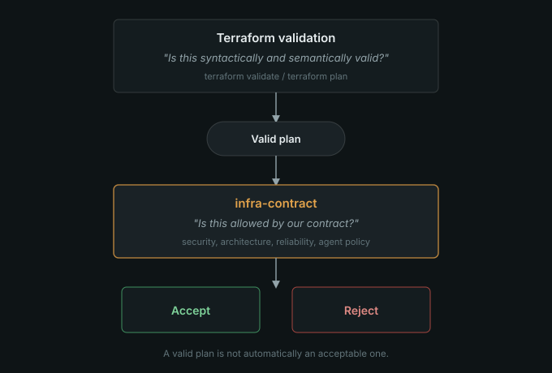
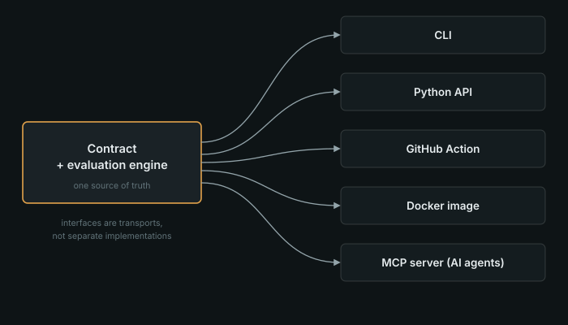
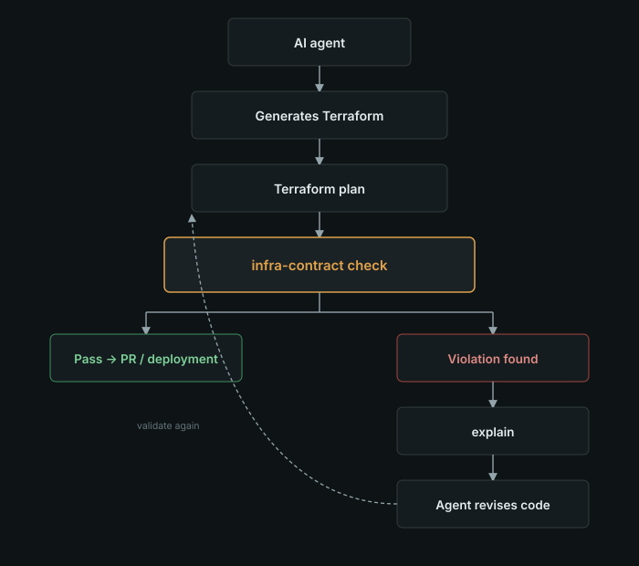

Infrastructure as code solved one important problem: infrastructure could finally be treated like software. We could put Terraform in Git, review it in pull requests, run `terraform plan` in CI, and reproduce environments instead of clicking through a cloud console.

But there's a gap in that story. A Terraform configuration can be completely valid — it applies cleanly, every attribute is well-formed — and still be infrastructure you never wanted. It can create a public database. It can grant an IAM role far more than it needs. It can introduce an architecture your team never agreed to support. It can quietly delete a production database on the next apply.

I ran into this gap while working on [ops-pilot](https://github.com/khaleddeissa/ops-pilot), an agent system that reads Terraform and telemetry to reason about infrastructure incidents. Once an AI agent is reading infrastructure, the next question is obvious: what happens the day an agent starts _writing_ it? An agent can produce Terraform that is syntactically perfect and still wrong for the environment it's about to touch. Reviewing every generated line by hand doesn't scale, and it's exactly the kind of judgment call that shouldn't live only in one engineer's head.

That's the problem [**infra-contract**](https://github.com/khaleddeissa/infra-contract) is built around: give humans and AI agents the same, independently enforced answer to "is this infrastructure allowed?" — before it's merged or deployed.

## Valid isn't the same as acceptable

It's worth making this distinction concrete. Suppose a Terraform change contains:

```hcl
resource "aws_db_instance" "main" {
  publicly_accessible = true
  storage_encrypted   = true
}
```

Terraform has no complaint here. The configuration is syntactically and semantically valid, and it will apply successfully. But your organization might have a rule that looks like this:

```yaml
security:
  database:
    public_access: false
    encryption: required
```

The plan is valid Terraform. It also violates the contract. That gap — between "this applies" and "this is what we intended to allow" — is what infra-contract closes.



## The contract itself

The idea is deliberately simple: describe what your infrastructure is allowed to look like in a small, version-controlled YAML file, and evaluate every proposed change against it.

```yaml
version: "1"
project:
  name: my-service
cloud:
  provider: aws
  regions: [eu-central-1]
architecture:
  compute:
    allowed: [ecs]
  database:
    allowed: [rds-postgres]
security:
  database:
    public_access: false
    encryption: required
  iam:
    wildcard_permissions: forbidden
reliability:
  production:
    backups: required
    multi_az: required
agent:
  production_apply: false
  destructive_changes:
    require_human_approval: true
ci:
  fail_on: [high, critical]
```

Nothing here is exotic. Rules like "production databases must be encrypted, private, and backed up" already exist on most teams — they're just usually scattered across a security wiki page, a Terraform module convention, a PR checklist, and a few people's memory. Those sources drift apart over time, and an AI agent generating infrastructure has no way to consult any of them. Writing the rule down as a contract, next to the Terraform it governs, turns it into something that can be checked instead of assumed:

```text
my-service/
├── terraform/
│   ├── main.tf
│   ├── database.tf
│   └── networking.tf
├── infra-contract.yaml
└── .github/workflows/infrastructure.yml
```

A pull request that changes the architecture and the rules that govern it can now be reviewed together, in one diff.

## What it checks, and how

infra-contract's built-in policy areas cover **security** (public access, encryption, IAM wildcard permissions), **architecture** (which compute and database types are allowed), **reliability** (backups, Multi-AZ for production), **change risk**, and **agent behavior** — for example, forbidding production applies or requiring human sign-off on destructive changes.

There are two ways to hand it infrastructure to evaluate. The preferred one is an actual Terraform plan, which gives the validator concrete information about what's about to change:

```bash
terraform plan -out=tfplan
terraform show -json tfplan > tfplan.json
infra-contract check --plan tfplan.json
```

When a plan isn't available, it can also fall back to scanning `.tf` source directly:

```bash
infra-contract check path/to/terraform
```

That path is explicitly treated as lower-confidence — source scanning can't see what Terraform actually intends to change the way a plan can, and the tool doesn't pretend otherwise.

Not every violation deserves to block a deployment, so severity is configurable end to end, from `info` up through `critical`:

```bash
infra-contract check --plan tfplan.json --format json --fail-on high
```

And because deleting a database is a very different kind of mistake than renaming a tag, infra-contract also reasons about **change risk** separately from policy compliance. A deletion or replacement of a stateful resource — a database, cache, or storage bucket — is treated as critical whenever the contract requires human approval for destructive changes. Policy answers "is this allowed?"; risk answers "how dangerous is this specific change?" They're related questions, but not the same one.

When something does fail, `explain` turns a bare pass/fail into something you can act on:

```bash
infra-contract explain --resource aws_db_instance.main --plan tfplan.json
```

And `fix` proposes a change without ever applying one — it stops at a suggestion, on purpose:

```bash
infra-contract fix --plan tfplan.json
```

That boundary matters more than it might seem. A validator that quietly "fixes" your infrastructure for you can turn one problem into a different one. infra-contract is meant to stay a guardrail, not become a second, hidden deployment path.

## One engine, five interfaces

The same contract and the same evaluation engine are reachable from several directions, and none of them get special authority over the others:

```bash
# CLI
infra-contract check --plan tfplan.json
```

```python
# Python
from contracts import load_contract
from engine import Evaluator
from providers import TerraformProvider

contract = load_contract("infra-contract.yaml")
document = TerraformProvider().load("tfplan.json")
result = Evaluator().run(document, contract)
print(result.to_dict())
```

```yaml
# GitHub Actions
- uses: khaleddeissa/infra-contract@v0.1.2
  with:
    plan: tfplan.json
    fail-on: high
    comment-on-pr: true
```

```bash
# Docker
docker run --rm -v "$PWD:/workspace:ro" -w /workspace \
  ghcr.io/khaleddeissa/infra-contract:v0.1.2 \
  check --contract infra-contract.yaml .
```

```bash
# MCP, for AI agents
infra-contract mcp --contract infra-contract.yaml
```



Internally, the repository is split so this stays true rather than becoming five slightly different implementations. Provider adapters normalize Terraform/OpenTofu into a provider-neutral intermediate representation; policies and the engine evaluate that representation against a contract; the CLI, MCP server, and GitHub Action are just transports on top. The dependency flow only goes one way, and the project has architecture tests that stop core packages from importing interface layers — so the engine can't quietly start depending on how it was invoked.

```text
src/
├── contracts/  # YAML schema and loader
├── ir/         # provider-neutral infrastructure model
├── policies/   # policy primitives and built-in rules
├── engine/     # evaluation, scoring, risk
├── providers/  # Terraform/OpenTofu adapters
├── cli/        # CLI
├── mcp/        # MCP server
└── ai/         # generated agent instructions
```

The GitHub Action is a thin composite wrapper around the same CLI: it installs infra-contract, runs `check` with your inputs, uploads the raw JSON results as a build artifact, and — if you enable it — posts a scored summary comment directly on the pull request, so a reviewer doesn't have to go digging through CI logs to see what failed.

## Why this matters more once agents are writing Terraform

This is the part of the project I care about most. An AI agent producing valid Terraform is not the same claim as an AI agent producing Terraform that complies with your architecture and your operational rules. Those are genuinely different statements, and it's easy to conflate them if the only thing checking the agent's output is a human skimming a diff.

That's why infra-contract ships an MCP server rather than just a CLI. The goal isn't to give an agent more authority over infrastructure — it's closer to the opposite. The server exposes contract discovery, policy lookup, source and plan validation, violation explanations, single-resource preflight checks, and change-risk analysis. It does **not** expose a way to apply infrastructure. An agent can ask what's allowed, why something failed, and what would make it compliant — and then go revise its own output — without ever being handed the authority to deploy.

```text
AI agent
   │
   ▼
Generate Terraform
   │
   ▼
Terraform plan
   │
   ▼
infra-contract check
   │
   ├── Pass ──────────────► PR / deployment
   │
   └── Violation
          │
          ▼
       explain
          │
          ▼
     Agent revises
          │
          └──────────────► validate again
```



The policy stays external to the agent's own reasoning. The agent doesn't get to decide what "safe" means for a given project — the contract does, and it's the same contract a human reviewer and CI are checking against.

## Getting it running

Installation is a single command, either through `uv` or `pip`:

```bash
uv tool install infra-contract
# or
pip install infra-contract
```

It's on PyPI at [pypi.org/project/infra-contract](https://pypi.org/project/infra-contract/#description), requires Python 3.10+, and its runtime dependencies are intentionally small: Pydantic for the contract schema, PyYAML, Typer and Rich for the CLI, and the official MCP SDK for the agent-facing server.

From there, `init` gives you a starting contract rather than a blank page:

```bash
cd my-infrastructure-repository
infra-contract init
infra-contract check
```

It's worth reading the generated contract before trusting it as an actual boundary — `init` gets you a reasonable starting point, not a finished policy for your organization.

If you'd rather not install anything locally, the same CLI is published as a container image on GHCR, built as a multi-stage image that runs as a non-root user and is intentionally CLI-only, with no HTTP port to manage:

```bash
docker pull ghcr.io/khaleddeissa/infra-contract:v0.1.2
```

See the [package on GHCR](https://github.com/khaleddeissa/infra-contract/pkgs/container/infra-contract) for available tags. And if CI is where you'd rather enforce this, the action is published on the [GitHub Marketplace](https://github.com/marketplace/actions/infrastructure-contract) — pin it to a released tag or commit SHA rather than a floating branch:

```yaml
name: Infrastructure contract
on: [pull_request]
permissions:
  contents: read
  pull-requests: write # only needed when comment-on-pr is true

jobs:
  validate:
    runs-on: ubuntu-latest
    steps:
      - uses: actions/checkout@v7
      - uses: khaleddeissa/infra-contract@v0.1.2
        with:
          plan: tfplan.json
          fail-on: high
          comment-on-pr: true
```

The project is currently at **v0.1.2**, its latest stable release, with v0.1.0 and v0.1.1 as earlier tags along the way. The repository's `examples/` directory has complete starting points for a basic Terraform setup, a production service, a RAG application, the Python API, the GitHub Action, Docker, an MCP client, human-approval gating, and the `explain`/`fix` workflow.

## What it deliberately doesn't do

It's just as important to say what infra-contract is not. It isn't Terraform or OpenTofu, and it doesn't replace either. It isn't a cloud deployment platform — it doesn't provision anything in AWS, Azure, or GCP. It isn't an autonomous apply tool; nothing in it decides to deploy infrastructure on its own. And it isn't a complete security platform — a policy engine can't reason about every runtime condition in a live cloud environment, so it's meant to sit alongside cloud-native controls, IAM, runtime monitoring, and code review rather than replace them.

One limitation worth stating plainly: **unknown resources produce no opinion.** If a resource type isn't modeled by the current policy system, infra-contract won't invent a judgment about it. That's a reason to treat it as one layer of a broader defense, not the only one.

## The bigger idea

Terraform tells you what you intend to build. A contract tells you what a project is actually willing to accept. infra-contract's job is to connect those two statements and give the same answer to whoever — or whatever — is asking: a developer at their terminal, a CI pipeline, a Python script, or an AI agent about to open a pull request.

I don't think the answer to AI agents writing infrastructure is to keep them away from it entirely. It's to get more precise about the boundary around what they — and we — are allowed to change, and to write that boundary down somewhere everyone and everything can actually read it.

The project is open source and still early. If you try it, I'd genuinely like to hear what's missing — particularly around provider coverage, policy design, and what a useful AI-agent workflow around infrastructure should look like next.
