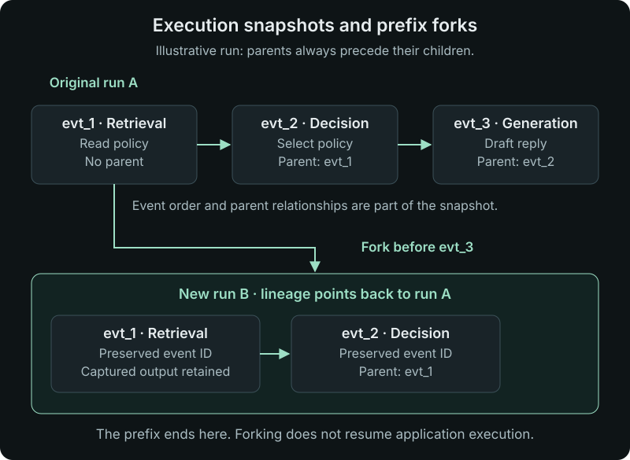
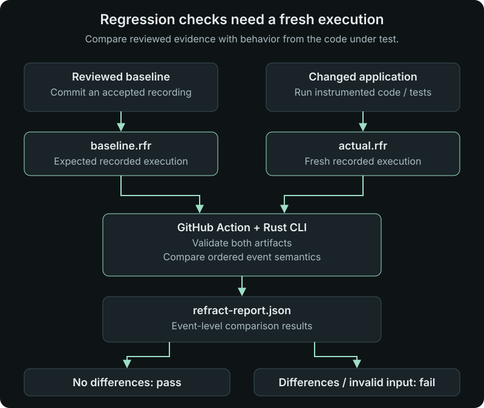

An AI application can return a plausible answer while taking a path we did not expect. It might retrieve the wrong document, call a tool with incomplete input, carry stale state into another step, or recover from a failure in a way that changes the result.

The final answer does not tell us which of those things happened. To understand the behavior, we need the execution behind it: what was called, what came back, which events were connected, and where the state changed.

That is the problem my latest project, [**llm-refract**](https://github.com/khaleddeissa/llm-refract), addresses. It records model calls, tools, retrieval, decisions, state changes, checkpoints, and failures in a shared execution model. A portable `.rfr` file carries that evidence between application code, a terminal, a browser workspace, a coding agent, and a regression pipeline.

## The execution is the thing we need to inspect

Consider a support application answering a question about a return policy. There might be a retrieval step, an order lookup, a decision about which policy applies, and a model call that drafts the response. If the answer is wrong, each step gives us a different place to investigate.

With an execution recording, we can inspect the retrieval output, follow the relationship to the generation event, and see the captured answer alongside its provider and model attributes. We can also compare that recording with a fresh run after changing the application.

The model is provider-neutral: applications emit a common event representation instead of making the recording depend on one model vendor. That does require instrumentation. Supporting canonical events from different providers does not mean every provider or framework is automatically instrumented.

## One recording across several interfaces

The architecture keeps capture separate from the engine that interprets the execution. Python and TypeScript SDKs capture events. The Rust engine handles validation, persistence, replay policies, and comparison. The browser inspector and MCP interface use the same REST API.

The cover diagram maps the component and data flow described in the project's [architecture document](https://github.com/khaleddeissa/llm-refract/blob/main/docs/architecture.md). Its arrows show submission, storage, or interface use.

Explore the same architecture below, or open it in Mermaid Live to edit the diagram.

<pre class="mermaid">
flowchart LR
  SDK[Python / Node SDKs] --> Run[Canonical execution]
  Run --> Artifact[Readable .rfr]
  Run --> API[Rust API]
  API --> Storage[(SQLite / SQLx)]
  UI[React viewer] --> API
  MCP[MCP tools] --> API
  Artifact --> CLI[Rust CLI / libraries]
  CLI --> Operations[Inspect / recorded replay / prefix fork / diff]
  Operations --> CI[Fresh recording regression comparison]
</pre>

The canonical model is shared by the Rust engine and language-neutral JSON schemas. SDKs produce snapshots; the native collector validates and redacts those snapshots before persisting them in SQLite through SQLx. The REST API, viewer, and MCP operate on that recorded data. The CLI and Rust libraries also work directly with artifacts, keeping the offline path independent of a running server.

This gives the recording a life beyond the process that created it. A developer can inspect a file offline, load executions into a local workspace, or hand the same evidence to an agent. The project also includes operational skills that describe supported debugging and regression workflows; those instructions use the existing interfaces rather than implementing another execution engine.

## Record a small execution

The Python library requires Python 3.11 or newer:

```bash
pip install llm-refract
```

Here is a minimal, manually recorded example. The outputs are illustrative values, so it runs without contacting a model or retrieval service:

```python
import refract

with refract.run("returns-assistant", path="returns.rfr"):
    policy = refract.event(
        type="retrieval",
        name="Read return policy",
        output={"return_window_days": 30},
    )
    refract.event(
        type="generation",
        name="Compose reply",
        parent_id=policy,
        output={"text": "You have 30 days to return your order."},
        attributes={"provider": "example", "model": "recorded-example"},
    )
```

In an application, record the actual outputs of your retrieval and model calls. The `parent_id` connects the answer to the retrieval event, preserving a relationship that would be easy to lose in independent log messages.

For Node applications, install the TypeScript SDK:

```bash
npm install @llm-refract/sdk
```

```typescript
import { refract } from "@llm-refract/sdk";

await refract.run(
  "order-assistant",
  async () => {
    refract.event({
      type: "tool.call",
      name: "check_delivery",
      output: { status: "delivered" },
    });
  },
  { path: "order.rfr" },
);
```

Both examples write local files. Adding `endpoint: "http://localhost:8000"` to the TypeScript options, or the equivalent `endpoint` keyword to the Python run, also connects the recording to a running server. The [Python guide](https://github.com/khaleddeissa/llm-refract/blob/main/docs/usage/python.md) and [TypeScript guide](https://github.com/khaleddeissa/llm-refract/blob/main/docs/usage/typescript.md) cover the broader SDK workflows.

## A file you can open and carry with you

New `.rfr` recordings are UTF-8 text. A JSON header describes the format and checksum, followed by formatted execution JSON. You can open the file in an editor or process it with the CLI. The SHA-256 checksum detects payload corruption; it does not authenticate who produced the recording.

The Rust CLI can be installed from a source checkout with `cargo install --path crates/refract-cli`. With `refract` installed, the Python example above can be inspected directly:

```bash
refract validate returns.rfr
refract inspect returns.rfr
refract replay returns.rfr
refract unpack returns.rfr -o returns.json
```

These operations work offline. The reader also supports the older ZIP-based recordings, while new files use the readable format. See the [artifact guide](https://github.com/khaleddeissa/llm-refract/blob/main/docs/usage/artifacts.md) for format and conversion details.

## Open the browser workspace

The container bundles the Rust server, CLI, and React inspector, with SQLite storage under `/data`. Start a local workspace with:

```bash
docker run --rm \
  -p 127.0.0.1:8000:8000 \
  -v refract-data:/data \
  ghcr.io/khaleddeissa/llm-refract:latest
```

Open `http://localhost:8000`, then submit an execution using an SDK endpoint. The named volume preserves recordings between container runs. The image contains the execution tooling; it does not include an inference model.


*A [tool-call recording](https://github.com/khaleddeissa/llm-refract/blob/main/assets/Inspector_Layout_2.PNG) from the repository's inspector walkthrough. Selecting an event reveals the data that was actually captured.*

The inspector lets you follow the timeline, inspect inputs and outputs, compare stored runs, and export a `.rfr` file.


*A [two-step retrieval and generation example](https://github.com/khaleddeissa/llm-refract/blob/main/assets/Inspector_Layout_3.PNG), including the selected answer's parent event and replay policy. These screenshots and the [project logo](https://github.com/khaleddeissa/llm-refract/blob/main/assets/llm-refract-logo.svg) come directly from the repository assets.*

## Replay, fork, and compare have specific meanings

**Recorded replay returns captured outputs.** It does not call the model again or execute external tools. That makes the saved evidence available without repeating the original side effects, but it does not tell you what new application code would do.

**A fork preserves the prefix before a selected event.** It creates a new run identity and retains lineage. It does not resume application code from that point. Forking before the first event therefore produces a valid branch with no events.



*An illustrative three-event run and its prefix fork. Event IDs are retained within the new run; the run itself receives a new ID.*

Runs are immutable snapshots, and their events form an ordered parent graph: a parent must appear before its child. A fork records its relationship to the source run and retains the events before the selected boundary. The architecture document notes that it remains in a running state until a future continuation mechanism exists; the state alone does not mean application code is executing.


*An [empty prefix fork](https://github.com/khaleddeissa/llm-refract/blob/main/assets/Inspector_Layout_1.PNG). The stored running status is metadata, not evidence of a background model invocation.*

**Diff compares ordered event semantics.** Generated identifiers and timing are ignored, but recorded behavior can still differ. To investigate an application change, capture a fresh execution and compare it with the earlier recording:

```bash
refract diff baseline.rfr actual.rfr
```

Comparison covers event positions, parent relationships, inputs, outputs, attributes, status, and replay policy. This makes the shape and content of the recorded execution part of the review, while generated IDs and timing do not create differences on their own.

Those boundaries matter because debugging old evidence and testing new behavior answer different questions. The [CLI guide](https://github.com/khaleddeissa/llm-refract/blob/main/docs/usage/cli.md) documents command behavior and exit-code details.

## Turn a reviewed execution into a regression baseline

A useful regression workflow starts with an execution you have reviewed. After changing the application, run the instrumented code again to produce an actual recording, then compare the two. Replaying the baseline against itself cannot test the code change.



*The application produces the fresh recording before the comparison step. The Action validates and compares the two artifacts.*

The repository provides a composite GitHub Action that builds the Rust CLI, validates the inputs, and produces `refract-report.json`. Differences or invalid recordings fail the step. After your workflow has generated `actual.rfr`, add:

```yaml
- uses: khaleddeissa/llm-refract@v0.1.1
  with:
    baseline: recordings/baseline.rfr
    actual: actual.rfr
```

This is a comparison step, not a complete application test workflow: the preceding steps must create the fresh recording. Baseline updates should be reviewed with the change that prompted them. The current comparison reports event-level differences; configurable thresholds and semantic model graders are not implemented.

At the time of writing, the [CI guide](https://github.com/khaleddeissa/llm-refract/blob/main/docs/usage/ci.md) documents direct use by release tag and says the Action is not currently listed on Marketplace. The supplied [Marketplace link](https://github.com/marketplace/actions/refract-execution-regression) is included for reference; use the repository instructions for setup.

## Give coding agents access to the same evidence

The MCP interface exposes ten read-only tools for inspecting existing execution evidence. Optional write tools allow importing snapshots and creating prefix forks. An agent can work from the recorded events available to the developer, while the same engine continues to define what inspection, replay, and comparison mean.

The [MCP guide](https://github.com/khaleddeissa/llm-refract/blob/main/docs/usage/mcp.md) describes setup, and the [skills guide](https://github.com/khaleddeissa/llm-refract/blob/main/docs/usage/skills.md) covers the operational workflows. This is useful when asking an agent to investigate a failing run: the recording gives it concrete inputs and outputs to examine.

## Current scope and where to start

llm-refract is an early, open-source project under Apache-2.0. Local capture, offline inspection, a persistent browser workspace, and execution comparison are useful starting points. The current server lacks built-in authentication, tenancy, retention controls, and encrypted exports, so public multi-tenant hosting is outside its current scope. The [production guide](https://github.com/khaleddeissa/llm-refract/blob/main/docs/production.md) explains those boundaries.

The first experiment can be small: record one retrieval and one model call, open the resulting file, inspect the run, then change the application and capture it again. That gives you a concrete way to see what changed between executions.

For me, the central idea is that an AI execution should remain useful after the application finishes. A portable recording makes the steps available for inspection, discussion, and comparison wherever the next piece of engineering work happens.
